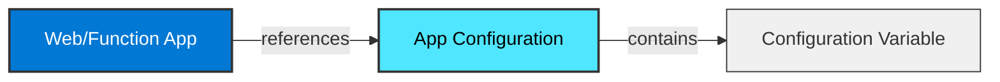
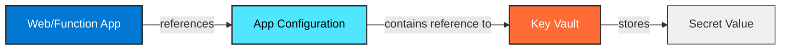

# Azure App Configuration & Key Vault Integration Guide

## Overview

This guide explains how to properly manage environment variables and secrets for Azure Web Apps and Function Apps using Azure App Configuration and Azure Key Vault. This approach eliminates the need for plain environment variables in app settings, following security best practices.

## Architecture

### Pattern 1: Plain Configuration Variables

When your application needs plain configuration values, they are stored directly in App Configuration:



### Pattern 2: Secrets via Key Vault

When your application needs secrets, App Configuration stores a reference to Key Vault:



## Configuration Management

### Step 1: Create Configuration Values in App Configuration

#### For Plain Configuration Variables

1. Navigate to your **App Configuration** resource in the Azure Portal
2. Go to **Configuration Management -> Configuration Explorer**
3. Click **+ Create** → **Key-value**
4. Enter the following:
   - **Key**: A descriptive name (e.g., `TEAMS_WEBHOOK_URL`)
   - **Label**: Use for environment and apps segmentation (e.g., `name-service-prod`, `name-func-test`)
   - **Content type** (optional): Leave blank
5. Click **Apply**

**Example Configuration Keys:**
```
SERVICE_URL = "https://test.url.com"
PORT = "1234"
APP_ENVIRONMENT = "prod"
```

#### For Secret References

1. Navigate to your **Key Vault** resource
2. Go to **Secrets**
3. Click **+ Generate/Import**
4. Enter:
   - **Name**: Secret identifier which contains service name and lower case variable with dashes instead of underscores (e.g., `homepage-connection-timeout`)
   - **Value**: Your secret value
   - Click **Create**
5. Copy the **Secret Identifier** (URI)

6. Navigate to your **App Configuration** resource
7. Go to **Configuration Explorer**
8. Click **+ Create** → **Key Vault Reference**
9. Enter:
   - **Key**: The same name as in the App itself (e.g., `TEAMS_WEBHOOK_URL`)
   - **Labels**: Use for environment and apps segmentation (e.g., `name-service-prod`, `name-func-test`)
   - **Subscription**: use appropriate subscription for your app
   - **Resource group**: use resource group which contains your Key Vault
   - **Key Vault**: select a Key Vault 
   - **Secret**: select the secret you've previously created
10. Click **Apply**

**Example Key Vault Reference:**
```json
{
  "uri": "https://your-keyvault.vault.azure.net/secrets/service-db-password"
}
```

> **Note**: The system will automatically resolve this reference when reading from App Configuration. Your app will receive the actual secret value, not the reference.

### Step 2: Grant App Service/Function App Access

Your Web App or Function App needs access to both App Configuration and Key Vault.

**DevOps Engineers are responsible for this part! In case of inproper access management or roles assignment let them know and handle it.**

#### Grant Access to App Configuration


1. Navigate to your **App Configuration** resource
2. Go to **Access control (IAM)**
3. Click **+ Add** → **Add role assignment**
4. Select role: **`App Configuration Data Reader`**
5. Assign to: Your Web App or Function App managed identity
6. Click **Review + assign**

#### Grant Access to Key Vault

1. Navigate to your **Key Vault** resource
2. Go to **Access control (IAM)**
3. Click **+ Add** → **Add role assignment**
4. Select role: **`Key Vault Secrets User`**
5. Assign to: Your Web App or Function App managed identity
6. Click **Review + assign**

> **Important**: Ensure your Web App or Function App has Key Vault Reference Identity assigned via Azure CLI:
```
az webapp/functionapp update --resource-group <group-name> --name <app-name> --set keyVaultReferenceIdentity={identityResourceId}
```

You can find you Managed Identity ResourceID in Overview -> top right corner -> JSON view.

### Step 3: Configure App Service/Function App to Use App Configuration

Your application needs to know where to find App Configuration at startup.

1. Navigate to your **Web App** or **Function App**
2. Go to **Settings** → **Environment variables**
3. Click **+Add** at App Settings
4. Set a name: **`TEAMS_WEBHOOK_URL`**
5. Set the value to your App Configuration endpoint using template 
```
@Microsoft.AppConfiguration(Endpoint=https://myAppConfigStore.azconfig.io; Key=myAppConfigKey; Label=myKeyLabel)
```
6. Click **Apply**

## Best Practices

### Do's ✅

- **Use managed identities** for authentication (system-assigned or user-assigned)
- **Store all secrets in Key Vault**, not in App Configuration directly
- **Use labels** in App Configuration to organize settings by environment
- **Separate concerns**: Plain config in App Configuration, secrets in Key Vault
- **Use descriptive key names** (e.g., `CATALOG_SERVICE_BASE_URL`)
- **Audit access** to Key Vault and App Configuration
- **Rotate secrets regularly** and update references as needed
- **Version your configurations** using labels for rollback capability

### Don'ts ❌

- **Never store secrets directly in App Configuration** - use Key Vault references instead
- **Never hardcode configuration values** in application code
- **Don't use connection strings** as environment variables in app settings
- **Don't skip managed identity setup** - always use identities instead of connection strings
- **Don't grant excessive permissions** - follow the principle of least privilege
- **Don't forget to save** after making configuration changes
- **Don't mix different environments** - use labels to keep them separate

## Troubleshooting

### Issue: "Access Denied" errors

**Cause**: The app's managed identity doesn't have the required permissions.

**Solution**:
1. Verify the managed identity is enabled on the Web App/Function App
2. Check that the identity has `App Configuration Data Reader` role on App Configuration
3. Check that the identity has `Key Vault Secrets User` role on Key Vault
4. Wait 1-2 minutes for Azure role assignments to propagate

### Issue: Configuration values not loading

**Cause**: The App Configuration endpoint is not properly configured.

**Solution**:
1. Verify the `AppConfig:Endpoint` application setting exists and is correct
2. Check that the endpoint URL is publicly accessible
3. Ensure the application code is correctly loading from App Configuration
4. Review application logs for specific error messages

### Issue: Key Vault secrets not resolving

**Cause**: The Key Vault reference in App Configuration is malformed or the secret doesn't exist.

**Solution**:
1. Verify the Key Vault reference format: `{"uri":"https://..."}`
2. Ensure the secret exists in Key Vault with the correct name
3. Verify the Key Vault URI includes the secret version

### Issue: Application restarts after configuration changes

**Cause**: This is expected behavior - configuration is typically loaded at application startup.

## Summary

By following this guide, your team will:

1. ✅ Keep all secrets secure in Key Vault
2. ✅ Centralize configuration management in App Configuration
3. ✅ Use managed identities for secure, passwordless authentication
4. ✅ Eliminate plain environment variables from app settings
5. ✅ Follow Azure security best practices
6. ✅ Maintain consistent configuration across Web Apps and Function Apps

---

**Questions or Issues?** Contact your DevOps team or refer to the [official Azure App Configuration documentation](https://learn.microsoft.com/en-us/azure/azure-app-configuration/).
