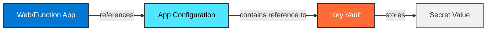

# Azure App Configuration & Key Vault Integration Guide

## Overview

This guide explains how to properly manage environment variables and secrets for Azure Web Apps and Function Apps using Azure App Configuration and Azure Key Vault. This approach eliminates the need for plain environment variables in app settings, following security best practices.

## Architecture

### Pattern 1: Plain Configuration Variables

When your application needs plain configuration values, they are stored directly in App Configuration:


### Pattern 2: Secrets via Key Vault

When your application needs secrets, App Configuration stores a reference to Key Vault:



## Configuration Management

### Step 1: Create Configuration Values in App Configuration

#### For Plain Configuration Variables

1. Navigate to your **App Configuration** resource in the Azure Portal
2. Go to **Configuration Explorer**
3. Click **+ Create** → **Key-value**
4. Enter the following:
   - **Key**: A descriptive name (e.g., `AppSettings:DatabaseTimeout`)
   - **Value**: The actual configuration value (e.g., `30`)
   - **Content type** (optional): Leave blank or use `application/json` for complex values
   - **Labels** (optional): Use for environment segmentation (e.g., `prod`, `dev`)
5. Click **Apply**

**Example Configuration Keys:**
```
AppSettings:LogLevel = "Information"
AppSettings:MaxRetries = "3"
AppSettings:ApiBaseUrl = "https://api.example.com"
Database:ConnectionTimeout = "30"
```

#### For Secret References

1. Navigate to your **Key Vault** resource
2. Go to **Secrets**
3. Click **+ Generate/Import**
4. Enter:
   - **Name**: Secret identifier (e.g., `DbPassword`)
   - **Value**: Your secret value
   - Click **Create**
5. Copy the **Secret Identifier** (URI)

6. Navigate to your **App Configuration** resource
7. Go to **Configuration Explorer**
8. Click **+ Create** → **Key-value**
9. Enter:
   - **Key**: A descriptive name (e.g., `AppSettings:DbPassword`)
   - **Value**: Paste the Key Vault secret reference in the format:
     ```
     {"uri":"https://your-keyvault.vault.azure.net/secrets/DbPassword/version"}
     ```
   - **Content type**: Select **`application/vnd.microsoft.appconfig.keyvaulturi+json`** from the dropdown
   - **Labels** (optional): Use for environment segmentation
10. Click **Apply**

**Example Key Vault Reference:**
```json
{
  "uri": "https://your-keyvault.vault.azure.net/secrets/DbPassword/abc123def456"
}
```

> **Note**: The system will automatically resolve this reference when reading from App Configuration. Your app will receive the actual secret value, not the reference.

### Step 2: Grant App Service/Function App Access

Your Web App or Function App needs access to both App Configuration and Key Vault.

#### Grant Access to App Configuration

1. Navigate to your **App Configuration** resource
2. Go to **Access control (IAM)**
3. Click **+ Add** → **Add role assignment**
4. Select role: **`App Configuration Data Reader`**
5. Assign to: Your Web App or Function App managed identity
6. Click **Review + assign**

#### Grant Access to Key Vault

1. Navigate to your **Key Vault** resource
2. Go to **Access control (IAM)**
3. Click **+ Add** → **Add role assignment**
4. Select role: **`Key Vault Secrets User`**
5. Assign to: Your Web App or Function App managed identity
6. Click **Review + assign**

> **Important**: Ensure your Web App or Function App has a **System-assigned Managed Identity** enabled:
> - Navigate to your Web App/Function App
> - Go to **Identity** in the left menu
> - Under **System assigned**, toggle to **On**
> - Click **Save**

### Step 3: Configure App Service/Function App to Use App Configuration

Your application needs to know where to find App Configuration at startup.

#### Option A: Using Application Settings (Recommended)

1. Navigate to your **Web App** or **Function App**
2. Go to **Configuration** → **Application settings**
3. Click **+ New application setting**
4. Create a setting named: **`AppConfig:Endpoint`**
5. Set the value to your App Configuration endpoint (e.g., `https://your-appconfig.azconfig.io`)
6. Click **OK**
7. Click **Save** at the top

#### Option B: Using Connection String

Alternatively, you can use a connection string:

1. Navigate to your **Web App** or **Function App**
2. Go to **Configuration** → **Connection strings**
3. Click **+ New connection string**
4. Enter:
   - **Name**: `AppConfig`
   - **Value**: Your App Configuration connection string
   - **Type**: `Custom`
5. Click **OK**
6. Click **Save** at the top

### Step 4: Application Code Integration

Your application code needs to load configuration from App Configuration at startup.

#### For .NET Applications

Update your `Program.cs` or `Startup.cs`:

```csharp
using Azure.Identity;
using Azure.Data.AppConfiguration;

// In your configuration builder setup
var configBuilder = new ConfigurationBuilder()
    .AddJsonFile("appsettings.json")
    .AddJsonFile($"appsettings.{environment}.json", optional: true);

// Add App Configuration provider
var appConfigEndpoint = Environment.GetEnvironmentVariable("AppConfig:Endpoint");
if (!string.IsNullOrEmpty(appConfigEndpoint))
{
    configBuilder.AddAzureAppConfiguration(options =>
    {
        options.Connect(new Uri(appConfigEndpoint), new DefaultAzureCredential())
               .Select(KeyFilter.Any, LabelFilter.Null)  // Load all keys with no label
               .ConfigureKeyVaultSecretProvider(secret =>
               {
                   secret.SetCredential(new DefaultAzureCredential());
               });
    });
}

var config = configBuilder.Build();
```

#### For Node.js Applications

```javascript
const { AppConfigurationClient } = require("@azure/app-configuration");
const { DefaultAzureCredential } = require("@azure/identity");

const endpoint = process.env.AppConfig__Endpoint;
const client = new AppConfigurationClient(endpoint, new DefaultAzureCredential());

async function loadConfiguration() {
  const settings = await client.listConfigurationSettings();
  const config = {};
  
  for await (const setting of settings) {
    config[setting.key] = setting.value;
  }
  
  return config;
}
```

## Best Practices

### Do's ✅

- **Use managed identities** for authentication (system-assigned or user-assigned)
- **Store all secrets in Key Vault**, not in App Configuration directly
- **Use labels** in App Configuration to organize settings by environment
- **Separate concerns**: Plain config in App Configuration, secrets in Key Vault
- **Use descriptive key names** with hierarchical structure (e.g., `AppSettings:Security:JwtSecret`)
- **Audit access** to Key Vault and App Configuration
- **Rotate secrets regularly** and update references as needed
- **Version your configurations** using labels for rollback capability

### Don'ts ❌

- **Never store secrets directly in App Configuration** - use Key Vault references instead
- **Never hardcode configuration values** in application code
- **Don't use connection strings** as environment variables in app settings
- **Don't skip managed identity setup** - always use identities instead of connection strings
- **Don't grant excessive permissions** - follow the principle of least privilege
- **Don't forget to save** after making configuration changes
- **Don't mix different environments** - use labels to keep them separate

## Troubleshooting

### Issue: "Access Denied" errors

**Cause**: The app's managed identity doesn't have the required permissions.

**Solution**:
1. Verify the managed identity is enabled on the Web App/Function App
2. Check that the identity has `App Configuration Data Reader` role on App Configuration
3. Check that the identity has `Key Vault Secrets User` role on Key Vault
4. Wait 1-2 minutes for Azure role assignments to propagate

### Issue: Configuration values not loading

**Cause**: The App Configuration endpoint is not properly configured.

**Solution**:
1. Verify the `AppConfig:Endpoint` application setting exists and is correct
2. Check that the endpoint URL is publicly accessible
3. Ensure the application code is correctly loading from App Configuration
4. Review application logs for specific error messages

### Issue: Key Vault secrets not resolving

**Cause**: The Key Vault reference in App Configuration is malformed or the secret doesn't exist.

**Solution**:
1. Verify the Key Vault reference format: `{"uri":"https://..."}`
2. Check that the Content type is set to `application/vnd.microsoft.appconfig.keyvaulturi+json`
3. Ensure the secret exists in Key Vault with the correct name
4. Verify the Key Vault URI includes the secret version

### Issue: Application restarts after configuration changes

**Cause**: This is expected behavior - configuration is typically loaded at application startup.

**Solution**:
1. Implement configuration refresh polling to reload settings without restarting
2. Or manually restart the app through the Azure Portal
3. Consider using Azure App Configuration feature flags for dynamic behavior changes

## Summary

By following this guide, your team will:

1. ✅ Keep all secrets secure in Key Vault
2. ✅ Centralize configuration management in App Configuration
3. ✅ Use managed identities for secure, passwordless authentication
4. ✅ Eliminate plain environment variables from app settings
5. ✅ Follow Azure security best practices
6. ✅ Maintain consistent configuration across Web Apps and Function Apps

---

**Questions or Issues?** Contact your DevOps team or refer to the [official Azure App Configuration documentation](https://learn.microsoft.com/en-us/azure/azure-app-configuration/).
